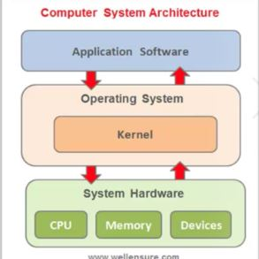

# **OPERATING SYSTEM**
## What is software?
A software is a set of instruction that tells a computer how to work.
### There are two types of software:
1. System software Ex: Operating system, device drivers
2.  Application software Ex:

1.Word Processing Software:
Microsoft Word
2. Spreadsheet Software:
Microsoft Excel
3. Presentation Software:
Microsoft PowerPoint
4. Web Browsers:
Google Chrome
Mozilla Firefox
Microsoft Edge
Safari
5. Email Clients:
Microsoft Outlook
6. Graphic Design Software:
Adobe Photoshop
## What is operating system ?
operating system is a system software used to make communication between Hardware and  software.

## Operating system architecture

## Compiler/Intrepreter:
Translates human language into machine instructions

## Compiler: 
Validate the entire source and provide the errors Once.

## Intrepreter:

Validate the code line by line. if one lines got error it tell to fix that particular line error then validate the next line.

## Types of operating systems:
1. Linux
2. Windows

## Linux Flavors:
1. Ubuntu
2. CentOs
3. Red hat enterprise
4. Fedora

## Directory Navigation:
1. ls             -
2. ls -la         -
3. ls -l          - 
4. pwd            -
5. cd             -
6. cd ~           -
7. cd[directory_path] -
8. dirs           -

## Files
1. mkdir -
2. rm[filename] -
3. rm -r[directory name]
4. rm -rf[directory name]
5. cp[source file][destinationfile]
   
